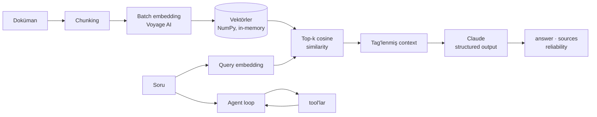

# Capstone Assistant

Lokaldeki dokümanlardan cevap vermeye çalışan bir AI asistanı.

Cevaplar yalnızca retrieve edilen kaynak pasajlardan gelir. Her cevapta citation ve bir güvenilirlik skoru var. Cevap dokümanlarda yoksa asistanın bunu söylemesi gerekiyor.

LangChain'i ve vektör veritabanlarını bilerek atladım. Her katmanı kendim görmek istedim, o yüzden buradaki her şey provider SDK'ları üzerine yazılmış düz Python.

> **Durum:** Faz 0–4 tamamlandı ve çalışıyor. API katmanı ve deployment henüz önümde. Bkz. [Yol haritası](#yol-haritası).

---

## Ne öğrenmeye çalıştım

RAG'i birleştirmek kolay, anlamak zor. Her aşamayı elle yazıp nerede kırıldığını görmek istedim.

Cevabını aradığım üç soru:

- **Modelin uydurmasını nasıl engellersin?** Onu tag'lenmiş kaynak bloklarıyla sınırlandırıp, cevap orada yoksa reddetmesini istiyorsun. Çoğunlukla işe yarıyor.
- **Bir cevabın gerçek olup olmadığını nasıl kontrol edersin?** Pydantic model olarak döndürüyorsun; citation'lar tam chunk index'lerine geri eşleniyor.
- **Hiçbir dokümanın cevaplayamadığı sorular ne olacak?** Tool-calling agent loop'u hesap ve canlı veri işlerini üstleniyor.

---

## Mimari



---

## Neler yapıyor

| | |
|---|---|
| **Ingestion** | Metni paragraf chunk'larına böler, boşları eler |
| **Batch embedding** | Tüm chunk'lar N çağrı değil tek Voyage AI çağrısında |
| **Vectorized retrieval** | Top-k cosine similarity tek matris çarpımı: `(N, 1024) @ (1024,)` |
| **Grounded generation** | Kaynakla sınırlı prompt, açık reddetme davranışı |
| **Structured output** | Pydantic model: `answer`, `sources`, `reliability` |
| **Tool-calling agent** | Multi-turn loop, dispatcher registry, max-step guard |
| **Fail-fast config** | Tipli ayarlar, import anında doğrulanıyor |

---

## Tech stack

**Core** — Python 3.12 · [uv](https://github.com/astral-sh/uv) · Pydantic · pydantic-settings

**AI** — Anthropic SDK (`claude-haiku-4-5`) · Voyage AI (`voyage-4`, 1024 boyut)

**Veri** — NumPy

**Planlanan** — FastAPI · Uvicorn · Docker

---

## Yapı

```
capstone-assistant/
├── config.py              # Tipli ayarlar
├── main.py                # FastAPI app (henüz yazılmadı)
├── core/
│   ├── ingest.py          # load_document · chunk_text · embed_chunks
│   ├── retrieve.py        # top-k retrieval
│   ├── generate.py        # build_context · RagAnswer · generate
│   └── agent.py           # tool'lar, dispatcher, agent loop
├── data/                  # Kaynak dokümanlar
├── pyproject.toml
└── .env                   # API key'leri (commit edilmiyor)
```

---

## Kurulum

Python 3.12 ve [uv](https://github.com/astral-sh/uv) gerekiyor.

```bash
git clone https://github.com/<kullanici-adiniz>/capstone-assistant.git
cd capstone-assistant

uv python pin 3.12
uv sync
```

Proje kökünde `.env` oluşturun:

```env
ANTHROPIC_API_KEY=sk-ant-...
VOYAGE_API_KEY=pa-...
```

Her aşamayı proje kökünden modül olarak çalıştırın:

```bash
uv run python -m core.ingest      # chunk'la ve embed et
uv run python -m core.retrieve    # top-k pasajı getir
uv run python -m core.generate    # tam RAG pipeline
uv run python -m core.agent       # tool'larla agent loop
```

---

## Nasıl çalışıyor

**Chunking.** Dokümanlar boş satırlardan bölünüyor, yani paragraflar semantik birim oluyor. İşe yarayan en basit yöntem ve bedelini şimdiden görüyorum: test korpusundaki chunk'lar 29 ile 579 karakter arasında.

**Embedding.** Tüm chunk'lar tek bir batch request ile Voyage AI'a gidiyor. Dokümanlar `input_type="document"`, sorular `input_type="query"` kullanıyor — model asimetrik eğitilmiş, bunu dokümantasyonu okuyana kadar bilmiyordum.

**Retrieval.** Voyage unit-length vektör döndürüyor, dolayısıyla cosine similarity aslında düz bir nokta çarpımı. Bu da tüm korpusu skorlamayı tek matris-vektör çarpımına, top-k'yı tek `argsort`'a indiriyor. Chunk başına loop yok. Bunu çözmek projenin en keyifli kısmıydı.

**Context.** Getirilen chunk'lar index'li tag'lere sarılıyor:

```xml
<source id="0">...</source>
<source id="1">...</source>
```

ID'ler sıfır tabanlı, liste index'leriyle birebir eşleşiyor. Burada bir kayma olsa bütün citation'lar sessizce bozulurdu.

**Generation.** System prompt modeli tag içindeki içerikle sınırlıyor. Çıktı Pydantic modele parse ediliyor, böylece bozuk bir yanıt downstream'de değil sınırda patlıyor.

**Agent loop.** Modeli tool şemalarıyla çağır. `stop_reason` `tool_use` değilse dön. Değilse istenen her tool'u isim→fonksiyon dispatcher'ı ile çalıştır, sonucu `tool_result` bloğu olarak geri besle. Max-step guard sonsuz döngüyü engelliyor.

---

## Hâlâ pürüzlü olanlar

Failure mode'lar bana çalışan kısımlardan daha fazlasını öğretti, o yüzden onları yazılı tutuyorum.

- **Grounding garanti değil.** Bir adversarial testte model, reddetmesi gereken context'i özetledi. Bunun ne sıklıkta olduğunu ölçecek bir yöntemim henüz yok — eval harness'ın yol haritasında olma sebebi bu.
- **`calculate` `eval` kullanıyor.** Lokal bir tool için sorun değil ama üretime çıkaracağım bir şey değil. AST parser'a geçirmek to-do listemde.
- **Tool kullanımı olasılıksal.** Model bazen tool'u atlayıp aritmetiği kendi yapıyor. Bunun bir prompting problemi olduğunu düşünüyorum ama kanıtlayamadım.
- **Vektörler bellekte.** Bu ölçekte sorun değil, ayrıca similarity matematiğini öğrenirken görünür kalmasını sağladı. Gerçek vektör deposu sonraki adımlarda.
- **Client'lar her modülde ayrı oluşuyor.** Tek bir paylaşımlı modülde birleştirmek gerekiyor.

---

## Yol haritası

| Faz | Kapsam | Durum |
|-----|--------|-------|
| 0 | Proje iskeleti, tipli config | ✅ |
| 1 | Veri katmanı — ingest, chunk, embed | ✅ |
| 2 | Retrieval — semantic search | ✅ |
| 3 | Generation — citation'lı grounded cevaplar | ✅ |
| 4 | Agent ve tool'lar | ✅ |
| 5 | API katmanı — FastAPI, streaming | 🔜 |
| 6 | Sertleştirme — logging, retry, maliyet takibi | ⬜ |
| 7 | Docker ve deployment | ⬜ |
| 8 | Eval harness, memory, vektör deposu | ⬜ |

---

## Lisans

MIT